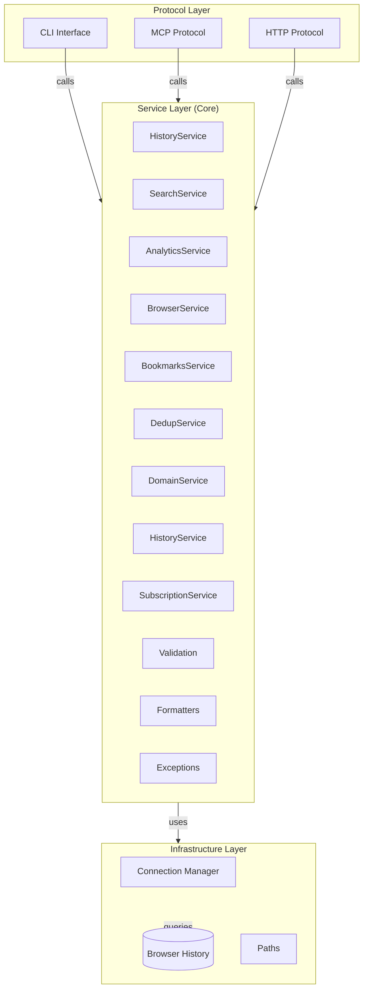

# ChronicleMCP Architecture

This document describes the internal architecture of ChronicleMCP after the restructuring for improved maintainability.

## Overview

ChronicleMCP is a secure, local-first Model Context Protocol (MCP) server that provides AI agents with access to local browser history data. The codebase follows a layered architecture with clear separation of concerns.

## Layered Architecture



## Project Structure

```
chronicle-mcp/
├── chronicle_mcp/
│   ├── __init__.py          # Package exports
│   ├── cli.py               # CLI commands
│   ├── server.py            # Entry point (imports from protocols)
│   ├── core/                # Business Logic Layer
│   │   ├── __init__.py
│   │   ├── _connection.py   # with_connection helper
│   │   ├── services.py      # HistoryService - facade/delegate
│   │   ├── search_service.py    # Search operations (search, recent, etc.)
│   │   ├── analytics_service.py # Analytics (compare periods, productivity)
│   │   ├── browser_service.py   # Browser listing (list_available_*)
│   │   ├── bookmarks_service.py # Bookmarks and downloads
│   │   ├── dedup_service.py     # Deduplication operations
│   │   ├── domain_service.py    # Domain operations
│   │   ├── history_service.py   # History operations (delete, sync, export)
│   │   ├── subscription_service.py # Real-time subscriptions
│   │   ├── validation.py    # Input validation functions
│   │   ├── formatters.py    # Response formatting
│   │   ├── exceptions.py    # Service-level exceptions
│   │   ├── events.py        # Event types
│   │   ├── realtime.py      # Real-time subscription manager
│   │   └── categories.py    # URL categorization
│   ├── protocols/           # Protocol Adapters
│   │   ├── __init__.py
│   │   ├── mcp.py           # MCP protocol adapter
│   │   ├── http.py          # HTTP protocol adapter
│   │   └── routes/          # HTTP route handlers
│   ├── connection.py        # Database connection management
│   ├── database.py          # Query operations
│   ├── paths.py             # Browser path detection
│   └── config.py            # Configuration loading
├── tests/
│   ├── conftest.py          # Pytest fixtures
│   ├── unit/
│   │   ├── core/           # Service layer tests
│   │   ├── protocols/      # Protocol adapter tests
│   │   └── infrastructure/ # Infrastructure tests
│   └── integration/        # Integration tests
├── Dockerfile
├── pyproject.toml
└── README.md
```

## Component Responsibilities

### 1. Protocol Layer

Thin adapters that handle protocol-specific concerns:

#### CLI Interface (`chronicle_mcp/cli.py`)
- Command-line parsing
- Delegates to appropriate protocol
- Process management (PID files, logging)

#### MCP Protocol (`chronicle_mcp/protocols/mcp.py`)
- FastMCP tool registration
- MCP-specific error handling (returns string errors)
- Calls HistoryService methods

#### HTTP Protocol (`chronicle_mcp/protocols/http.py`)
- Starlette route handlers
- HTTP-specific error handling (returns JSONResponse with status codes)
- Calls HistoryService methods

### 2. Service Layer (Core)

Contains all business logic, shared by all protocols. The service layer is split into a **facade** (`HistoryService`) and **specialized service modules**.

#### HistoryService (`chronicle_mcp/core/services.py`)

Facade service that delegates to specialized service modules. Provides a unified API for all operations:

```python
class HistoryService:
    """Facade service that delegates to specialized service modules."""

    _with_connection = staticmethod(with_connection)

    @classmethod
    def search_history(cls, query, limit, browser, format_type) -> dict:
        return search_service.search_history(query, limit, browser, format_type)
```

**Key Principle:** All business logic lives in the specialized service modules. HistoryService is a thin wrapper that delegates to them.

#### Specialized Service Modules

Each module handles a specific domain of functionality:

##### SearchService (`chronicle_mcp/core/search_service.py`)
Handles all search-related operations:
- `search_history()` - Keyword search
- `get_recent_history()` - Recent visits
- `count_visits()` - Domain visit counts
- `list_top_domains()` - Top domains
- `get_most_visited_pages()` - Most visited pages
- `search_history_by_date()` - Date range search
- `search_by_domain()` - Domain-specific search
- `search_history_advanced()` - Advanced search with filters

##### AnalyticsService (`chronicle_mcp/core/analytics_service.py`)
Handles analytics and insights:
- `compare_time_periods()` - Compare browsing between periods
- `analyze_productivity()` - Productivity scoring
- `suggest_categories()` - URL categorization
- `export_visualization()` - Chart.js compatible data
- `generate_insights_report()` - Comprehensive reports

##### BrowserService (`chronicle_mcp/core/browser_service.py`)
Handles browser listing:
- `list_available_browsers()` - Browsers with history databases
- `list_available_bookmarks()` - Browsers with bookmarks
- `list_available_downloads()` - Browsers with downloads

##### BookmarksService (`chronicle_mcp/core/bookmarks_service.py`)
Handles bookmarks and downloads:
- `get_bookmarks()` - Get bookmarks with optional query filter
- `get_downloads()` - Get download history with optional query filter

##### DedupService (`chronicle_mcp/core/dedup_service.py`)
Handles history deduplication:
- `find_duplicate_entries()` - Find duplicate URLs
- `delete_duplicates()` - Remove duplicates with strategy

##### DomainService (`chronicle_mcp/core/domain_service.py`)
Handles domain-related operations:
- `categorize_url()` - URL category detection
- `categorize_batch()` - Batch categorization

##### HistoryService (`chronicle_mcp/core/history_service.py`)
Handles history management:
- `delete_history()` - Delete matching entries
- `sync_history()` - Sync between browsers
- `export_history()` - Export to CSV/JSON

##### SubscriptionService (`chronicle_mcp/core/subscription_service.py`)
Handles real-time subscriptions:
- `subscribe_to_history()` - Subscribe to changes
- `unsubscribe_from_history()` - Unsubscribe
- `get_subscription_status()` - Subscription info

#### Validation (`chronicle_mcp/core/validation.py`)

Pure functions for input validation:

```python
def validate_browser(browser: str) -> str:
    # Returns lowercase browser name
    # Raises ValidationError if invalid

def validate_limit(limit: int, min_val: int, max_val: int) -> int:
    # Returns validated limit
    # Raises ValidationError if out of range
```

**Functions:**
- `validate_browser()` - Browser name validation
- `validate_query()` - Query string validation
- `validate_limit()` - Numeric limit validation
- `validate_hours()` - Hours validation
- `validate_format_type()` - Format type validation
- `validate_domain()` - Domain validation
- `validate_date_range()` - Date range validation
- `validate_sort_by()` - Sort order validation
- `validate_fuzzy_threshold()` - Fuzzy threshold validation
- `validate_search_options()` - Search option validation
- `validate_merge_strategy()` - Merge strategy validation
- `validate_browsers_different()` - Browser difference check
- `validate_exclude_domains()` - Exclude domains validation

#### Formatters (`chronicle_mcp/core/formatters.py`)

Pure functions for response formatting:

```python
def format_search_results(rows, query, format_type) -> str:
    # Returns formatted string (markdown or JSON)
```

**Functions:**
- `format_search_results()` - Search results formatting
- `format_recent_results()` - Recent history formatting
- `format_domain_visits()` - Visit count formatting
- `format_top_domains()` - Top domains formatting
- `format_most_visited_pages()` - Most visited pages formatting
- `format_domain_search_results()` - Domain search formatting
- `format_advanced_search_results()` - Advanced search formatting
- `format_browser_stats()` - Stats formatting
- `format_export()` - Export formatting
- `format_delete_preview()` - Delete preview formatting
- `format_delete_result()` - Delete result formatting
- `format_sync_preview()` - Sync preview formatting
- `format_sync_result()` - Sync result formatting
- `format_available_browsers()` - Browser list formatting
- `format_error_message()` - Error message formatting

#### Exceptions (`chronicle_mcp/core/exceptions.py`)

Service-layer exception hierarchy:

```python
ServiceError (base)
├── ValidationError
├── BrowserNotFoundError
├── BrowserPathNotFoundError
├── DatabaseLockedError
├── PermissionDeniedError
├── DatabaseError
├── UnsupportedFormatError
└── InvalidDateRangeError
```

### 3. Infrastructure Layer

Low-level operations, protocol-agnostic.

#### Connection Manager (`chronicle_mcp/connection.py`)

- Creates temporary copies of browser databases
- Manages database connections
- Handles cleanup
- Provides context manager for safe access

#### Database Operations (`chronicle_mcp/database.py`)

- SQLite query execution
- URL sanitization
- Timestamp formatting
- Schema detection (Chrome/Firefox/Safari)

#### Browser Paths (`chronicle_mcp/paths.py`)

- Browser path detection per OS
- Path expansion (environment variables, home directory)
- Glob pattern matching for Firefox profiles

## Data Flow

### Service Layer Flow

```
┌─────────────────────────────────────────────────────────────────┐
│                        Request Flow                              │
└─────────────────────────────────────────────────────────────────┘

  Client Request
        │
        ▼
┌─────────────────┐    ┌──────────────────┐    ┌─────────────────┐
│  Protocol       │    │  Service Layer   │    │ Infrastructure  │
│  Adapter        │───▶│  (HistoryService)│───▶│  Layer          │
│  (HTTP/MCP/CLI) │    │                  │    │  (DB/Paths)     │
└─────────────────┘    └──────────────────┘    └─────────────────┘
        │                      │                       │
        │              Validation                      │
        │              Formatting                      │
        │              Business Logic                  │
        │                      │                       │
        ▼                      ▼                       ▼
  Response          Structured Data             SQLite Query
  (Protocol-specific)  (dict)                    (Connection)
```

### Example: Search History Flow

```
┌────────┐    ┌────────────┐    ┌────────────┐    ┌─────────┐    ┌────────┐
│  HTTP  │───▶│ History   │───▶│ Validation │───▶│ Database│───▶│Result  │
│ Client │    │ Service   │    │            │    │ Query   │    │Format  │
└────────┘    └────────────┘    └────────────┘    └─────────┘    └────────┘
                  │                  │                │
                  │          validate_query()   query_history()
                  │          validate_browser()  sanitize_url()
                  │          validate_limit()    format_chrome_timestamp()
                  │
                  ▼
          ┌───────────────┐
          │ Return dict   │
          │ {results,    │
          │  count,      │
          │  message}    │
          └───────────────┘
```

### Database Connection Flow

```
get_history_connection(browser)
         │
         ▼
┌─────────────────────────────────┐
│  1. Get browser path             │
│     (paths.get_browser_path)    │
└─────────────────────────────────┘
         │
         ▼
┌─────────────────────────────────┐
│  2. Validate path exists        │
│     (os.path.exists)            │
└─────────────────────────────────┘
         │
         ▼
┌─────────────────────────────────┐
│  3. Copy to temp file           │
│     (shutil.copy2)              │
│     Temp: ~/AppData/Local/tmp   │
└─────────────────────────────────┘
         │
         ▼
┌─────────────────────────────────┐
│  4. Open SQLite connection      │
│     (sqlite3.connect)            │
└─────────────────────────────────┘
         │
         ▼
┌─────────────────────────────────┐
│  5. Execute queries (yield)     │
└─────────────────────────────────┘
         │
         ▼
┌─────────────────────────────────┐
│  6. Close connection & cleanup   │
│     (conn.close)                │
│     (cleanup_temp_file)          │
└─────────────────────────────────┘
```

### MCP Tool Registration Flow

```
┌──────────────────────────────────────────────────────────────┐
│                    MCP Tool Registration                       │
└──────────────────────────────────────────────────────────────┘

  server.py imports mcp from protocols/mcp.py
         │
         ▼
  @tool decorator applied to functions
         │
         ▼
  FastMCP.register_tool("search_history", fn)
         │
         ▼
  AI Assistant calls tool via MCP protocol
         │
         ▼
  ┌─────────────────────────────────────┐
  │ MCP Handler                          │
  │ 1. Parse tool arguments              │
  │ 2. Call HistoryService.method()      │
  │ 3. Handle ServiceError → string error │
  │ 4. Return result["message"]          │
  └─────────────────────────────────────┘
```

### Subscription/Real-time Flow

```
┌──────────────────────────────────────────────────────────────┐
│                 Real-time Subscription Flow                   │
└──────────────────────────────────────────────────────────────┘

  Client calls subscribe_to_history(browser, event_types)
         │
         ▼
  HistoryService.subscribe_history_changes()
         │
         ▼
  SubscriptionManager.subscribe()
         │
         ├──▶ Create Subscription object
         │         with callback & event_types
         │
         ├──▶ Store in _subscriptions dict
         │
         └──▶ Return subscription_id

  Later: Browser history changes
         │
         ▼
  notify_new_history() called
         │
         ▼
  SubscriptionManager.publish_event()
         │
         ▼
  Match subscriptions by browser + event_type
         │
         ▼
  Execute callback(HistoryEvent)

### Example: Search History

```python
# HTTP Protocol
@app.route("/api/search", methods=["POST"])
async def search_endpoint(request):
    data = await request.json()
    try:
        result = HistoryService.search_history(
            query=data["query"],
            limit=data.get("limit", 5),
            browser=data.get("browser", "chrome"),
            format_type=data.get("format", "markdown")
        )
        return JSONResponse({"results": result["message"]})
    except ServiceError as e:
        return error_response(e.message, 400)

# MCP Protocol
@mcp.tool()
def search_history(query, limit, browser, format_type):
    try:
        result = HistoryService.search_history(
            query=query, limit=limit,
            browser=browser, format_type=format_type
        )
        return result["message"]
    except ServiceError as e:
        return f"Error: {e.message}"
```

## Key Benefits of New Architecture

### 1. Single Source of Truth
- All business logic in specialized service modules
- No code duplication between protocols
- Changes made once, applied everywhere

### 2. Testability
- Service layer can be tested independently
- Pure validation/formatting functions are easy to test
- Protocol adapters are thin and mostly delegation
- Each service module can be tested in isolation

### 3. Maintainability
- Clear separation of concerns
- Each service module has single responsibility
- Easy to understand and modify
- Facade pattern keeps API stable while internals evolve

### 4. Extensibility
- Easy to add new protocols (WebSocket, gRPC, etc.)
- Just create new adapter in `protocols/`
- Reuse existing service layer
- Add new service modules without touching existing code

### 5. Error Handling Consistency
- Service layer raises exceptions
- Each protocol catches and converts appropriately
- MCP: String error messages
- HTTP: Status codes + JSON

## Security

All security features remain unchanged:

### URL Sanitization
Sensitive query parameters removed from URLs before returning.

### Privacy-First
- All data stays local
- Temporary file copies deleted after each query
- No external servers contacted

## Migration Notes

If you were using the old structure:

### Old imports:
```python
from server import mcp, search_history
from chronicle_mcp.server_http import run_http_server
```

### New imports:
```python
from chronicle_mcp.protocols import mcp
from chronicle_mcp.protocols.http import run_http_server
from chronicle_mcp.core import HistoryService
```

---

## See Also

- [CLI Reference](CLI.md)
- [API Documentation](API.md)
- [Installation Guide](INSTALL.md)
- [Contributing Guide](../CONTRIBUTING.md)
- [GitHub Repository](https://github.com/nikolasil/chronicle-mcp)
